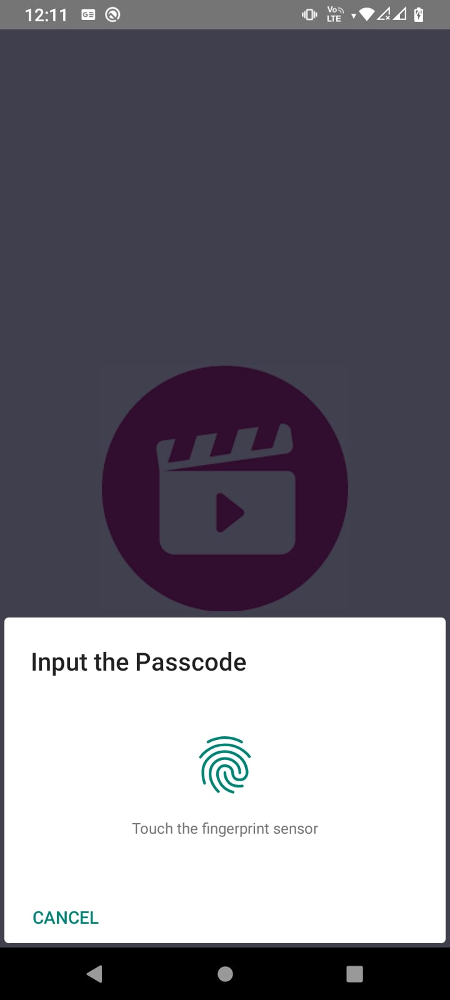

## Installation

### Metro

After cloning the repo, install the dependencies locally with [Yarn](https://yarnpkg.com/):

```sh
yarn install
```

Start your [Metro](https://facebook.github.io/metro/) server:

```sh
npx react-native start
```

### Android

```sh
npx react-native run-android
```

### iOS

```sh
pod install --repo-update --project-directory=ios
npx react-native run-ios
```

### Technologies Used
- React-native 
- Biometric library used

### Screenshots

